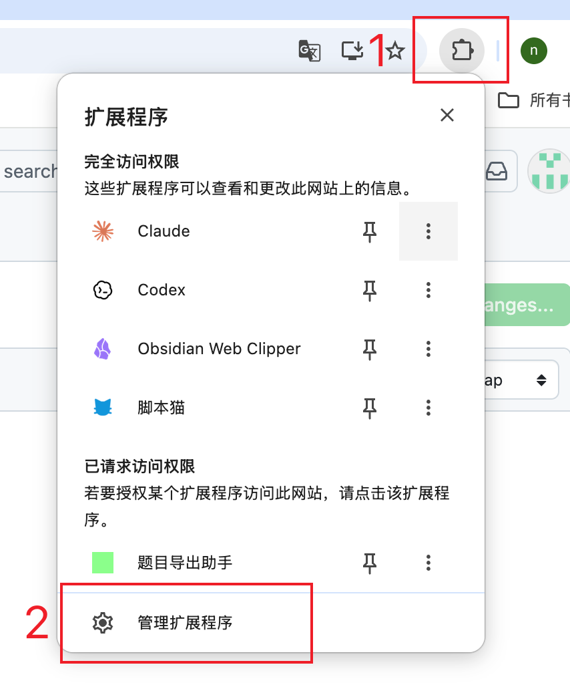
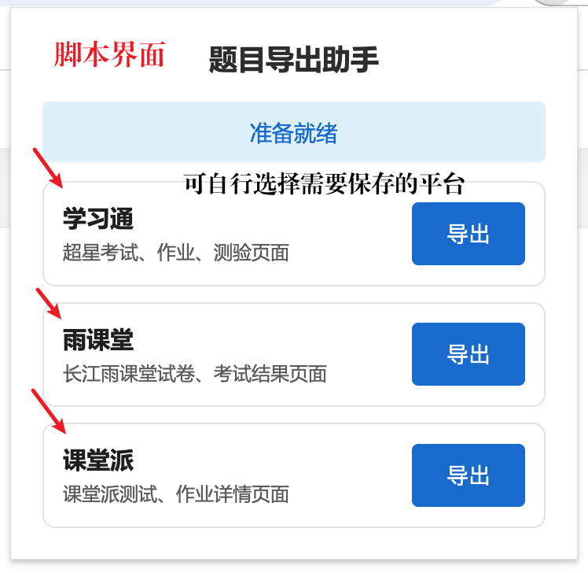
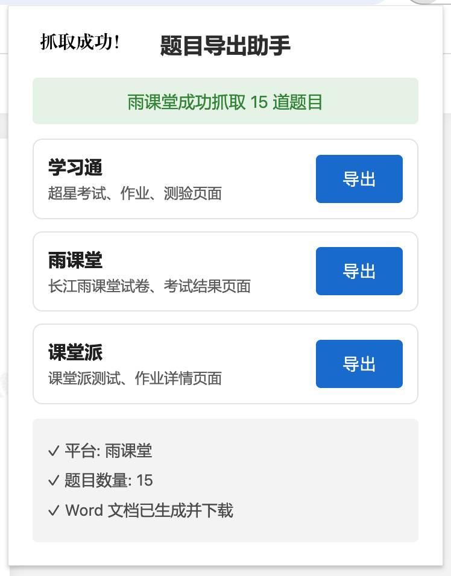

# 题目导出助手

一个浏览器扩展，可以把学习通（超星）、长江雨课堂、课堂派和智慧树页面中的题目导出为 Word 文档，方便离线复习。

> 另提供 **Python 命令行版**（`py_exporter/`），通过学习通接口登录后批量抓取已完成作业并导出为 Word / JSON / Markdown，详见 [py_exporter/README.md](py_exporter/README.md)。

## 使用声明

- 本项目仅供**个人学习与复习归档**使用，请勿用于考试作弊或任何违反学校、平台规定的行为。
- 仅用于导出**本人账号**下的资料；请勿抓取、传播他人或受版权保护的内容。
- 浏览器扩展在本地处理数据，不上传任何信息；Python 版的账号密码仅经 AES 加密后直接发送给学习通，不在本地落盘。
- 两个版本均**只读取与导出，不包含任何自动作答或提交作业的功能**。
- 因使用本工具产生的任何后果由使用者自行承担。

## 功能

- 一键抓取当前页面的所有题目
- 支持选择题、判断题、填空题、简答题等各种题型
- 导出为 Word 文档（.docx 格式）
- 支持学习通（超星）、长江雨课堂、课堂派、智慧树（知到）
- 支持长江雨课堂 AI 学习空间作业标签中的测试题逐题抓取
- 兼容 Edge 和 Chrome 浏览器

## 快速开始（推荐）

无需任何配置，下载即用：

**第一步：** 点击页面右上角绿色的 **Code** 按钮，选择 **Download ZIP**，下载完成后解压到本地任意文件夹。

**第二步：** 点击浏览器右上角的扩展图标 🧩，在弹出菜单底部点击「**管理扩展程序**」。



**第三步：** 进入扩展管理页面后，点击左上角的「**加载未打包的扩展程序**」，选择刚才解压的文件夹即可。


扩展图标出现在工具栏后，即可正常使用 ✅

> **Edge** 地址栏输入 `edge://extensions/`；**Chrome** 输入 `chrome://extensions/`，可直接打开扩展管理页面。

---

## 安装

### 准备图标文件

扩展需要图标才能加载。最简单的方法：

1. 随便找三张图片（或者用同一张）
2. 重命名为 `icon16.png`、`icon48.png`、`icon128.png`
3. 放到 `assets/` 文件夹

或者用在线工具生成：https://www.favicon-generator.org/
（此步可省略，图标已添加）

### 加载扩展

**Edge 浏览器：**
1. 地址栏输入 `edge://extensions/`
2. 打开右上角的"开发人员模式"
3. 点击"加载解压缩的扩展"
4. 选择项目文件夹

**Chrome 浏览器：**
1. 地址栏输入 `chrome://extensions/`
2. 打开右上角的"开发者模式"
3. 点击"加载已解压的扩展程序"
4. 选择项目文件夹

## 使用

**第一步：** 登录学习通、长江雨课堂或课堂派，打开考试、作业、练习或试卷页面。长江雨课堂 AI 学习空间可停留在作业标签的测试题页面，扩展会自动进入题目 iframe 逐题抓取。点击浏览器工具栏的扩展图标，弹出「题目导出助手」面板。根据当前页面选择对应平台，点击「**导出**」按钮。



**第二步：** 扩展自动抓取页面题目，成功后显示平台名称、题目数量及下载状态。



**第三步：** Word 文档自动下载到本地，包含完整题目、选项及参考答案，可直接用于离线复习。


## 开发

```bash
# 安装依赖
npm install

# 构建
npm run build

# 修改后回归测试
npm test

# 开发模式（自动监听文件变化）
npm run dev
```

每次修改完成后，还需要按 [TESTING.md](TESTING.md) 到指定的真实学习通页面执行抓取验证，并在反馈中说明题目数量、图片题/图片答案是否成功导出。

### 雨课堂加密字体映射

长江雨课堂部分题目会使用 `.xuetangx-com-encrypted-font` 和自定义 TTF 字体混淆 DOM 文本。扩展会读取 `lib/yuketang-font-map.json` 对这些字符做码点替换。

如果页面更换了字体文件，重新生成映射：

```bash
python3 -m pip install -r scripts/requirements-yuketang-font.txt
python3 scripts/generate_yuketang_font_map.py \
  --font-url https://fe-static-yuketang.yuketang.cn/fe_font/product/exam_font_239fdcc493de4ef5a4d14835f3a0243c.ttf \
  --output lib/yuketang-font-map.json
```

## 项目结构

```
├── manifest.json          # 扩展配置
├── popup/                 # 弹窗界面
├── content/               # 页面脚本
│   ├── parser.js         # 题目解析
│   └── content.js        # 消息处理
├── background/            # 后台服务
│   └── service-worker.js # Word 生成和下载
├── lib/                   # 库文件
│   ├── font-decrypt.js   # 字体解密
│   └── typr.js           # 字体解析（占位符）
└── src/                   # 源代码
    ├── docx-generator.js # Word 生成器
    └── service-worker.js # 后台服务源码
```

## Python 命令行版

`py_exporter/` 是与扩展等价的纯 Python 工具，适合批量导出。

```bash
cd py_exporter
python3 -m venv .venv
.venv/bin/pip install -r requirements.txt
.venv/bin/python run.py
```

交互流程：选登录方式（二维码 / 账号密码）→ 选课程 → 选作业（支持多选/全选）→ 选导出格式（Word / JSON / Markdown）。文件写入 `py_exporter/output/`。详见 [py_exporter/README.md](py_exporter/README.md)。

## 注意事项

- 仅供个人学习使用，请勿用于考试作弊（详见上文「使用声明」）
- 扩展在本地处理数据，不会上传任何信息
- 页面结构可能更新，如遇问题请提 issue

## 字体解密

学习通使用自定义字体加密文本。如果题目显示乱码：

1. 从 https://github.com/photopea/Typr.js 下载 `Typr.js`
2. 替换 `lib/typr.js` 文件
3. 重新加载扩展

不过大部分情况下不需要字体解密也能正常使用。

## 技术栈

- Manifest V3
- docx - Word 文档生成
- Webpack - 打包工具

## 更新日志

### v1.4.0 · 2026-06-14（雨课堂习题集导出）

- 新增雨课堂 studentCards 习题集页面支持...
- 题目内容从 ProblemBodys[0].Paragraphs → Lines → Texts → Text 路径精确提取...
- 支持单选题、多选题、填空题、主观题、投票题...
- 生成的 HTML 内置「🖨️ 打印 / 导出 PDF」按钮...
- 原有雨课堂试卷/考试结果页面的 Word 导出流程不受影响...
- 无需重新构建（仅改动 popup/popup.js 与 popup/popup.html）

### v1.3.0 · 2026-06-13 — 新增 Python 命令行版
- 🐍 **新增 `py_exporter/` Python 命令行工具**：走学习通接口登录并批量导出已完成作业
  - 支持二维码 / 账号密码登录（密码 AES 加密发送，不落盘）
  - 导出 Word / JSON / Markdown 三种格式，交互式选课程/作业/格式
  - 仅读取与导出，不含任何自动作答或提交功能
- 🖥️ **二维码登录优化**：生成二维码 PNG 自动打开 + 打印登录链接，解决控制台扫码困难
- 📦 **Windows 可执行版**：GitHub Actions 自动打包 exe 并发布到 [Releases](../../releases)
- 📄 补充 macOS / Linux 安装配置说明与「使用声明」

### v1.2.0 · 2026-06-12
- ✨ **新增智慧树（知到）平台支持**
  - 支持作业结果、考试页面的题目抓取
  - 多选题答案自动从选中选项推导（A、B、C 格式）
  - 从【多选题】【单选题】等标注精准识别题型
  - 修复答案字段空白的问题
- 🎨 **更新扩展图标**
  - 全新设计的 16 / 48 / 128px 图标

### v1.1.0 · 2026-06-12
- ✨ 新增长江雨课堂平台支持
- ✨ 新增课堂派平台支持
- ⚡ 性能优化：WeakMap 缓存评分、预计算选项选择器、base64 分块转换
- 🧹 移除生产环境 console.log 调试输出

### v1.0.0 · 初始版本
- 支持学习通（超星）题目导出
- 导出为 Word 文档（.docx）

---

## License

MIT
